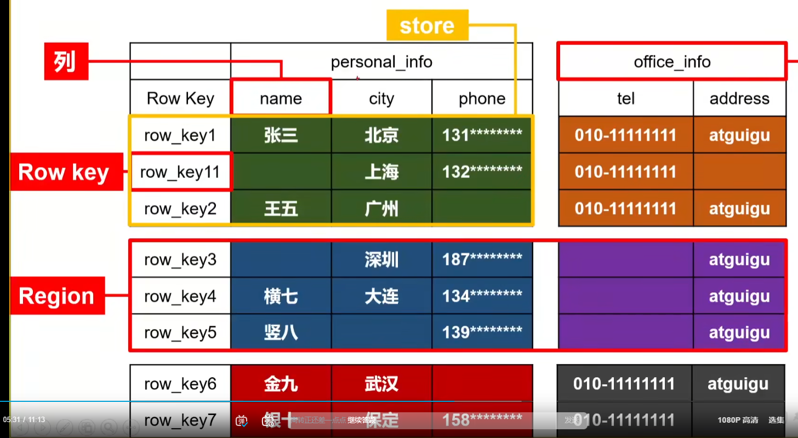

# HBase存储结构

## 1. Hbase的物理存储结构

### (1). Region来决定数据存在的节点

Hbase通过Row Key的字典表顺序来将一定范围的数据分成一个region，region**来决定数据存在的节点**

### (2). Store（列族）来决定数据存在的文件夹

不同的列族来决定数据存在的文件夹，例如上面的personal_info是在一个文件夹，office_info在另一个文件夹

### (3). HDFS的作用 

HBase采用HDFS来存储数据，但是**hdfs上面的数据是没有办法修改数据**，所以我们追加写新数据，**然后附带新的时间戳，通过时间戳**来决定哪个数据是最新的，用这种方式来决定数据的新旧。

## Row Key

Hbase的数据只能通过Row Key来进行读取，所以Row Key的设计至关重要

## HBase的结构

通过zookeeper实现**高可用**

### Master

**监控集群中的Region Server，负载均衡，故障转移**

### Region Server

Region Server 实现类为 HRegionServer，

主要作用如下: 

（1）负责数据 cell 的处理，例如写入数据 put，查询数据 get 等 

（2）拆分合并 region 的实际执行者，有 master 监控，有 regionServer 执行。

### Zookeeper  HBase

 通过 Zookeeper 来做 master 的高可用、记录 RegionServer 的部署信息、并且存储 有 meta 表的位置信息。
